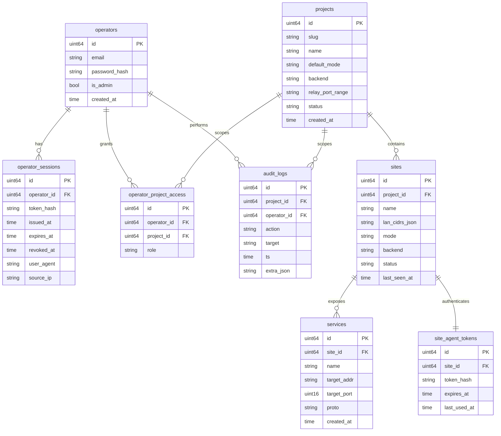

# 数据模型（GORM + SQLite）

## 1. ER 图



## 2. GORM Models

### 2.1 命名约定

- 表名：snake_case 复数（`operators`、`projects`）
- 字段名：snake_case
- 主键：`ID uint64`，用 GORM 默认行为
- 时间戳：`CreatedAt`、`UpdatedAt`、`DeletedAt`（软删除统一用）

### 2.2 Model 定义

```go
package model

import (
    "time"
    "gorm.io/gorm"
)

// 通用基础字段
type Base struct {
    ID        uint64         `gorm:"primaryKey" json:"id"`
    CreatedAt time.Time      `json:"created_at"`
    UpdatedAt time.Time      `json:"updated_at"`
    DeletedAt gorm.DeletedAt `gorm:"index" json:"-"`
}

// ─────────────────────────────────────────────────────
// Operator
// ─────────────────────────────────────────────────────
type Operator struct {
    Base
    Email        string `gorm:"uniqueIndex;not null;size:255" json:"email"`
    PasswordHash string `gorm:"not null;size:128" json:"-"`
    IsAdmin      bool   `gorm:"not null;default:false" json:"is_admin"`

    Sessions       []OperatorSession        `gorm:"foreignKey:OperatorID" json:"-"`
    ProjectAccess  []OperatorProjectAccess  `gorm:"foreignKey:OperatorID" json:"-"`
}

type OperatorSession struct {
    Base
    OperatorID uint64    `gorm:"index;not null" json:"operator_id"`
    TokenHash  string    `gorm:"uniqueIndex;not null;size:128" json:"-"`
    IssuedAt   time.Time `gorm:"not null" json:"issued_at"`
    ExpiresAt  time.Time `gorm:"index;not null" json:"expires_at"`
    RevokedAt  *time.Time `gorm:"index" json:"revoked_at,omitempty"`
    UserAgent  string    `gorm:"size:255" json:"user_agent"`
    SourceIP   string    `gorm:"size:45" json:"source_ip"`
}

// ─────────────────────────────────────────────────────
// Project
// ─────────────────────────────────────────────────────
type ProjectStatus string
const (
    ProjectStatusActive   ProjectStatus = "active"
    ProjectStatusDisabled ProjectStatus = "disabled"
)

type Backend string
const (
    BackendRathole Backend = "rathole"
    BackendNetbird Backend = "netbird"  // Phase 2
)

type SiteMode string
const (
    SiteModeEndpoint SiteMode = "endpoint"
    SiteModeSubnet   SiteMode = "subnet"  // Phase 2
)

type Project struct {
    Base
    Slug            string        `gorm:"uniqueIndex;not null;size:64" json:"slug"`
    Name            string        `gorm:"not null;size:255" json:"name"`
    DefaultMode     SiteMode      `gorm:"not null;default:'endpoint';size:32" json:"default_mode"`
    Backend         Backend       `gorm:"not null;default:'rathole';size:32" json:"backend"`
    RelayPortRange  string        `gorm:"not null;size:32" json:"relay_port_range"` // "20000-20999"
    Status          ProjectStatus `gorm:"not null;default:'active';size:32" json:"status"`

    Sites          []Site                  `gorm:"foreignKey:ProjectID" json:"-"`
    AccessGrants   []OperatorProjectAccess `gorm:"foreignKey:ProjectID" json:"-"`
}

type ProjectRole string
const (
    RoleOwner    ProjectRole = "owner"
    RoleOperator ProjectRole = "operator"
    RoleViewer   ProjectRole = "viewer"
)

type OperatorProjectAccess struct {
    Base
    OperatorID uint64      `gorm:"index;uniqueIndex:uk_operator_project;not null" json:"operator_id"`
    ProjectID  uint64      `gorm:"index;uniqueIndex:uk_operator_project;not null" json:"project_id"`
    Role       ProjectRole `gorm:"not null;default:'operator';size:32" json:"role"`
}

// ─────────────────────────────────────────────────────
// Site
// ─────────────────────────────────────────────────────
type SiteStatus string
const (
    SiteStatusPending SiteStatus = "pending" // 已创建未注册
    SiteStatusOnline  SiteStatus = "online"
    SiteStatusOffline SiteStatus = "offline"
)

type Site struct {
    Base
    ProjectID    uint64     `gorm:"index;not null" json:"project_id"`
    Name         string     `gorm:"uniqueIndex:uk_project_site_name;not null;size:64" json:"name"`
    LanCidrsJSON string     `gorm:"type:text" json:"lan_cidrs_json"` // ["192.168.10.0/24"]
    Mode         SiteMode   `gorm:"not null;default:'endpoint';size:32" json:"mode"`
    Backend      Backend    `gorm:"size:32" json:"backend"` // 空则继承 project.backend
    Status       SiteStatus `gorm:"not null;default:'pending';size:32" json:"status"`
    LastSeenAt   *time.Time `gorm:"index" json:"last_seen_at,omitempty"`
    Hostname     string     `gorm:"size:255" json:"hostname"`
    OS           string     `gorm:"size:32" json:"os"`           // linux/windows
    AgentVersion string     `gorm:"size:32" json:"agent_version"`

    Project   Project          `gorm:"foreignKey:ProjectID" json:"-"`
    Services  []Service        `gorm:"foreignKey:SiteID" json:"-"`
    AgentToken SiteAgentToken  `gorm:"foreignKey:SiteID" json:"-"`
}

// ─────────────────────────────────────────────────────
// Service
// ─────────────────────────────────────────────────────
type Proto string
const (
    ProtoTCP Proto = "tcp"
    ProtoUDP Proto = "udp" // Phase 2
)

type Service struct {
    Base
    SiteID     uint64 `gorm:"index;uniqueIndex:uk_site_svc_name;not null" json:"site_id"`
    Name       string `gorm:"uniqueIndex:uk_site_svc_name;not null;size:64" json:"name"`
    TargetAddr string `gorm:"not null;size:64" json:"target_addr"` // 127.0.0.1 / 192.168.10.50
    TargetPort uint16 `gorm:"not null" json:"target_port"`
    Proto      Proto  `gorm:"not null;default:'tcp';size:8" json:"proto"`
    RelayPort  uint16 `gorm:"index" json:"relay_port"` // 控制面分配，唯一性由 project 内端口段保证
}

// ─────────────────────────────────────────────────────
// Site agent token
// ─────────────────────────────────────────────────────
type SiteAgentToken struct {
    Base
    SiteID     uint64     `gorm:"uniqueIndex;not null" json:"site_id"`
    TokenHash  string     `gorm:"uniqueIndex;not null;size:128" json:"-"`
    ExpiresAt  *time.Time `gorm:"index" json:"expires_at,omitempty"` // null = 长期有效
    LastUsedAt *time.Time `gorm:"index" json:"last_used_at,omitempty"`
}

// ─────────────────────────────────────────────────────
// Audit log
// ─────────────────────────────────────────────────────
type AuditLog struct {
    ID         uint64    `gorm:"primaryKey" json:"id"`
    Ts         time.Time `gorm:"index;not null" json:"ts"`
    ProjectID  *uint64   `gorm:"index" json:"project_id,omitempty"` // null = 跨项目操作
    OperatorID *uint64   `gorm:"index" json:"operator_id,omitempty"` // null = 系统操作
    Action     string    `gorm:"index;not null;size:64" json:"action"`
    Target     string    `gorm:"size:255" json:"target"`
    SourceIP   string    `gorm:"size:45" json:"source_ip"`
    ExtraJSON  string    `gorm:"type:text" json:"extra_json"`
}
```

## 3. Migration 策略

### 3.1 工具
- **golang-migrate/migrate** + GORM 的 `AutoMigrate` 开发环境
- 生产环境用 SQL migration 文件（手写，保证可控）

### 3.2 目录约定

```
migrations/
├── 0001_init.up.sql
├── 0001_init.down.sql
├── 0002_add_xxx.up.sql
└── 0002_add_xxx.down.sql
```

### 3.3 Phase 1 init migration（节选）

```sql
-- 0001_init.up.sql
CREATE TABLE operators (
    id INTEGER PRIMARY KEY AUTOINCREMENT,
    email TEXT NOT NULL UNIQUE,
    password_hash TEXT NOT NULL,
    is_admin INTEGER NOT NULL DEFAULT 0,
    created_at DATETIME NOT NULL,
    updated_at DATETIME NOT NULL,
    deleted_at DATETIME
);
CREATE INDEX idx_operators_deleted_at ON operators(deleted_at);

CREATE TABLE operator_sessions (
    id INTEGER PRIMARY KEY AUTOINCREMENT,
    operator_id INTEGER NOT NULL REFERENCES operators(id),
    token_hash TEXT NOT NULL UNIQUE,
    issued_at DATETIME NOT NULL,
    expires_at DATETIME NOT NULL,
    revoked_at DATETIME,
    user_agent TEXT,
    source_ip TEXT,
    created_at DATETIME NOT NULL,
    updated_at DATETIME NOT NULL,
    deleted_at DATETIME
);
CREATE INDEX idx_operator_sessions_operator_id ON operator_sessions(operator_id);
CREATE INDEX idx_operator_sessions_expires_at ON operator_sessions(expires_at);
CREATE INDEX idx_operator_sessions_revoked_at ON operator_sessions(revoked_at);

-- ... projects, sites, services, etc.
```

## 4. 数据访问约定

### 4.1 Project 范围强制

所有跨业务表的查询**必须**在 SQL 层附加 `project_id` 过滤。封装一个 GORM scope：

```go
package dao

import "gorm.io/gorm"

// ScopeProject 强制按 project 范围过滤；非 admin 必须有 access
func ScopeProject(projectID uint64) func(*gorm.DB) *gorm.DB {
    return func(db *gorm.DB) *gorm.DB {
        return db.Where("project_id = ?", projectID)
    }
}

// ScopeOperatorProjects 限制为 operator 有 access 的项目集合
func ScopeOperatorProjects(operatorID uint64) func(*gorm.DB) *gorm.DB {
    return func(db *gorm.DB) *gorm.DB {
        return db.Where("project_id IN (?)",
            db.Table("operator_project_access").
                Select("project_id").
                Where("operator_id = ? AND deleted_at IS NULL", operatorID))
    }
}
```

业务代码：

```go
db.Scopes(ScopeOperatorProjects(opID)).Find(&sites)
```

### 4.2 Token 存储

`OperatorSession.TokenHash` / `SiteAgentToken.TokenHash` 存的是 **SHA-256 hash**，原始 token 只在颁发那一刻返回给客户端。

```go
func HashToken(raw string) string {
    h := sha256.Sum256([]byte(raw))
    return hex.EncodeToString(h[:])
}
```

### 4.3 Password hash

用 `bcrypt`，cost=12。

## 5. SQLite 配置

```go
db, err := gorm.Open(sqlite.Open("quicktun.db?_journal_mode=WAL&_busy_timeout=5000"),
    &gorm.Config{
        NamingStrategy: schema.NamingStrategy{
            SingularTable: false,
        },
        Logger: gormZapLogger, // zap 适配器
    })
```

WAL 模式让读写并发更好；Phase 1 单实例够用。Phase 2+ 量大可平迁 Postgres。
