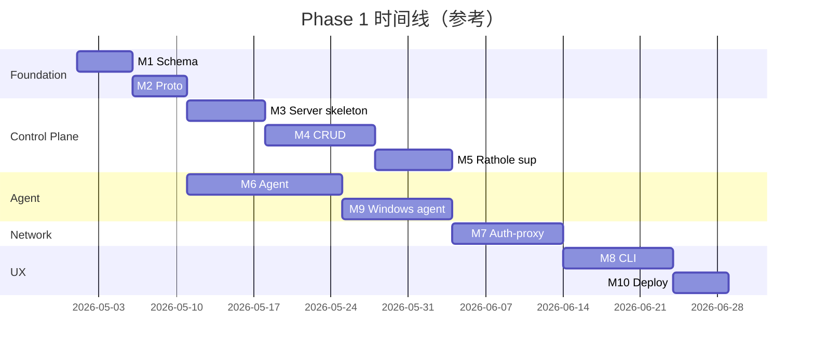

# 路标

## Phase 1：MVP（2-3 个月内目标）

> 目标：替代 TeamViewer/ToDesk 的多网点远程访问；端到端跑通 5-10 个 site。

### 里程碑

| 里程碑 | 交付物 | 验收标准 |
|---|---|---|
| **M1: Schema + Migration** | GORM model + SQL migration 文件 | `quicktun-server migrate` 干净跑通 |
| **M2: Proto + 代码生成** | api/quicktun/v1/*.proto + buf 配置 + 生成的 Go stub | `buf generate` 成功；`buf lint` 通过 |
| **M3: 控制面骨架** | gRPC server + grpc-gateway + 拦截器（auth, project scope, audit） | `quicktun login` + `whoami` 跑通 |
| **M4: Project / Site / Service CRUD** | 5 个资源的标准方法实现 | `quicktun project create / site add / service add` 跑通 |
| **M5: Rathole supervisor** | supervisor 模块 + rathole 配置渲染 + 集成测试 | 创建 project → rathole 进程自动起；改 service → 自动 reload |
| **M6: Agent 协议 + agent 实现** | Linux agent 端到端 | install.sh 后 site 自动注册 + 心跳 + 配置同步 |
| **M7: quicktun-auth-proxy** | TCP 反向代理 + token 校验 + cache | operator login → ssh hospital-01 端到端 |
| **M8: CLI 完成度** | ssh-config / status / forward / audit 命令 | 一行命令打开 SSH config 后裸 ssh 立刻能用 |
| **M9: Windows agent** | windows/amd64 agent + Windows Service 注册 | Win Server 2019 跳板机 onboard 跑通 |
| **M10: 部署脚本 + 文档** | install-server.sh + install-agent.{sh,ps1} + 用户手册 | 内部团队 2 个客户上线 |

### 实施依赖

### Phase 1 不做的（明确放弃，避免 scope creep）

- ❌ NetBird backend
- ❌ Subnet 模式
- ❌ Web UI
- ❌ 多租户 SaaS
- ❌ API token / 程序化 API
- ❌ 应用层认证（SSH cert / authorized_keys 同步）
- ❌ 内网自动扫描发现
- ❌ Agent 自更新
- ❌ HA / 多实例
- ❌ 2FA
- ❌ Long-lived gRPC stream（agent 走 polling）

## Phase 2：稳定 + 扩展（Phase 1 上线后 3-6 个月）

### 主题

| 主题 | 内容 |
|---|---|
| **NetBird backend** | 实现 `BackendInterface` 第二个 driver；Probe 自动选 backend；适配子网模式 |
| **Subnet 模式** | site `cidrs` 字段启用；ssh-config 生成 routing 信息；让 LAN 整段都被 mesh 触达 |
| **Agent 自更新** | 灰度策略（按 project / 按 channel）；签名校验 |
| **Long-lived stream** | agent ↔ 控制面改 BiDi stream，控制面可主动推命令（不用等下一次 heartbeat） |
| **2FA** | TOTP（Google Authenticator）；管理员可强制要求 |
| **API token** | 程序化 token，供 CI / 监控调控制面 API |
| **审计强化** | 审计日志数字签名；导出标准格式（CEF / JSON Lines） |
| **Web UI（可选）** | 只读 dashboard 优先：site 状态、audit 浏览、metrics |

## Phase 3：规模化（成熟后）

- HA 控制面（Postgres + 多实例）
- 监控完整接入（Prometheus + Grafana + 告警）
- IDS 集成（Suricata）
- 客户角色（如果有需要 SaaS 化的迹象）
- 跨 region relay 池（让远端客户连"最近"的 relay）
- IDP 集成（OIDC / SAML 单点登录）

## 长期愿景（也许永远不做）

- 移动端 operator app（iOS / Android 安装 quicktun client）
- Browser-based terminal（不装 SSH client 也能用）
- Marketplace 上的开源 / 商业版本拆分

## 决策机制

每个 Phase 结束做 retrospective，决定：

1. 已交付功能的实际使用情况（哪些被频繁用、哪些躺平）
2. 客户痛点排序（实战反馈 > 架构假想）
3. 下个 Phase 的 scope 调整
